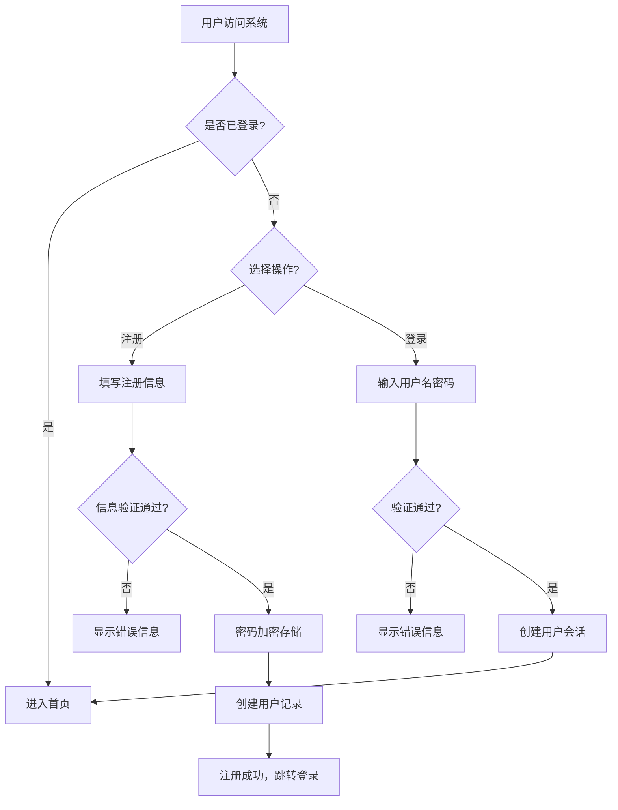
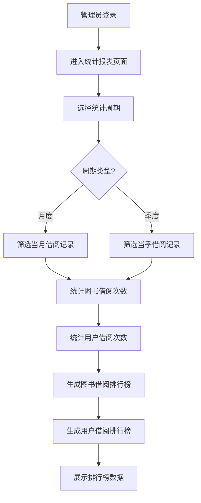
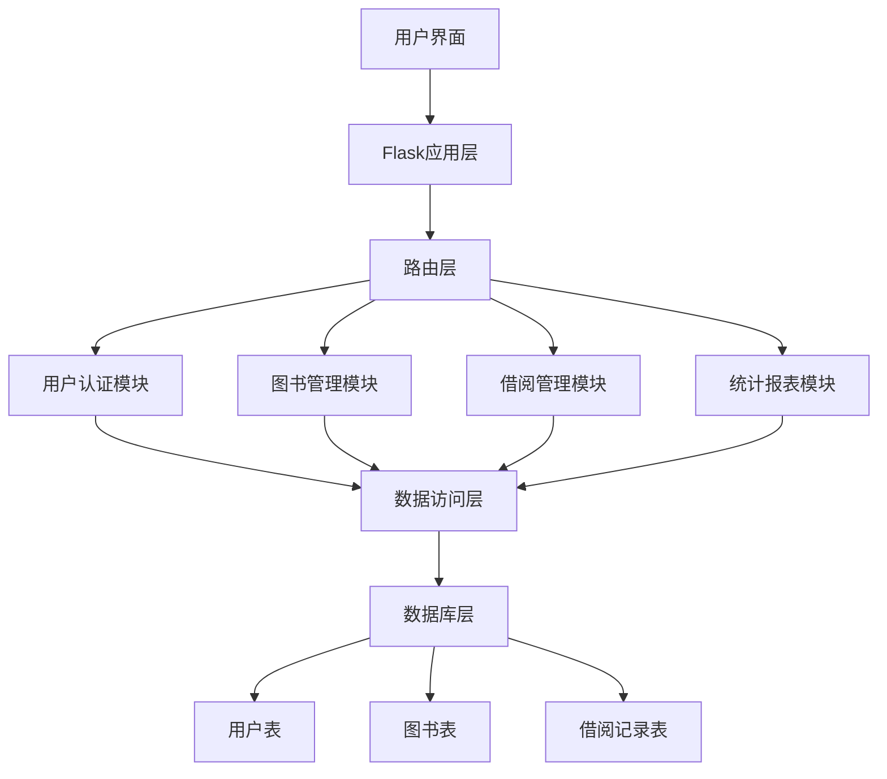

# 图书管理系统关键业务逻辑流程图

以下使用Mermaid语法展示图书管理系统的核心业务流程：

## 1. 用户注册/登录流程



## 2. 图书入库流程（管理员）

```mermaid
flowchart TD
    A[管理员登录] --> B[进入图书管理页面]
    B --> C[点击"添加图书"]
    C --> D[填写图书信息]
    D --> E{验证ISBN唯一?}
    E -->|否| F[显示错误信息]
    E -->|是| G[创建图书记录]
    G --> H[库存初始化]
    H --> I[入库成功，显示图书列表]
```

## 3. 图书查询流程

```mermaid
flowchart TD
    A[用户访问系统] --> B[进入图书查询页面]
    B --> C{选择查询方式?}
    C -->|关键词搜索| D[输入搜索条件]
    C -->|高级搜索| E[填写多字段条件]
    D --> F[执行查询]
    E --> F
    F --> G{查询结果?}
    G -->|无结果| H[显示"无匹配图书"]
    G -->|有结果| I[分页展示图书列表]
    I --> J{选择操作?}
    J -->|查看详情| K[显示图书详细信息]
    J -->|借书| L[执行借书流程]
```

## 4. 借书流程

```mermaid
flowchart TD
    A[用户登录] --> B[进入图书查询页面]
    B --> C[选择目标图书]
    C --> D{图书库存充足?}
    D -->|否| E[显示"库存不足"]
    D -->|是| F[创建借阅记录]
    F --> G[更新图书库存减1]
    G --> H[计算应还日期]
    H --> I[借书成功，显示借阅信息]
```

## 5. 还书流程

```mermaid
flowchart TD
    A[用户登录] --> B[进入我的借阅页面]
    B --> C[选择要归还的图书]
    C --> D[点击"归还图书"]
    D --> E[记录实际还书日期]
    E --> F{是否逾期?}
    F -->|是| G[标记为逾期]
    F -->|否| H[标记为正常归还]
    G --> I[更新图书库存加1]
    H --> I
    I --> J[还书成功，显示结果]
```

## 6. 借阅排行榜生成流程



## 7. 系统架构流程

